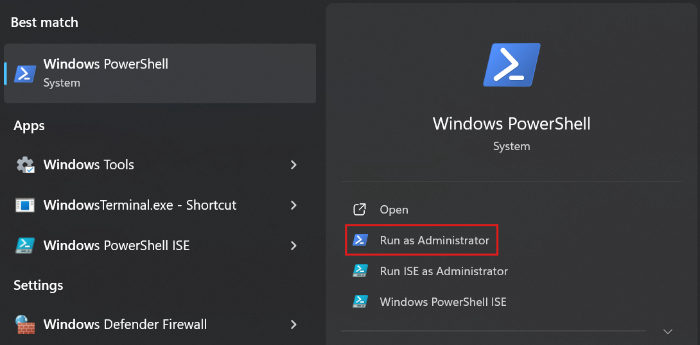
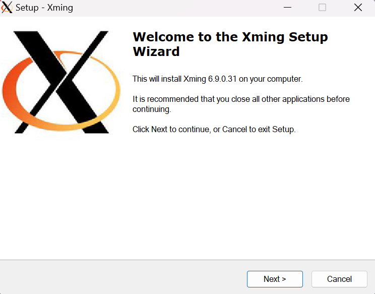
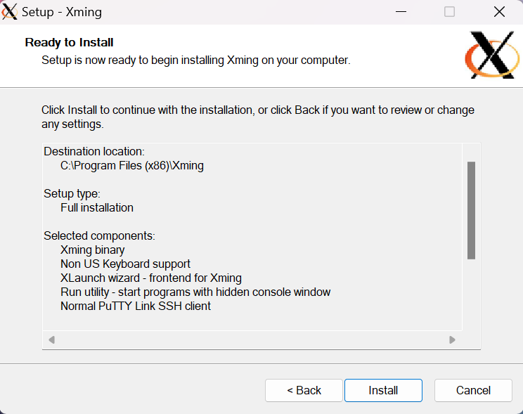
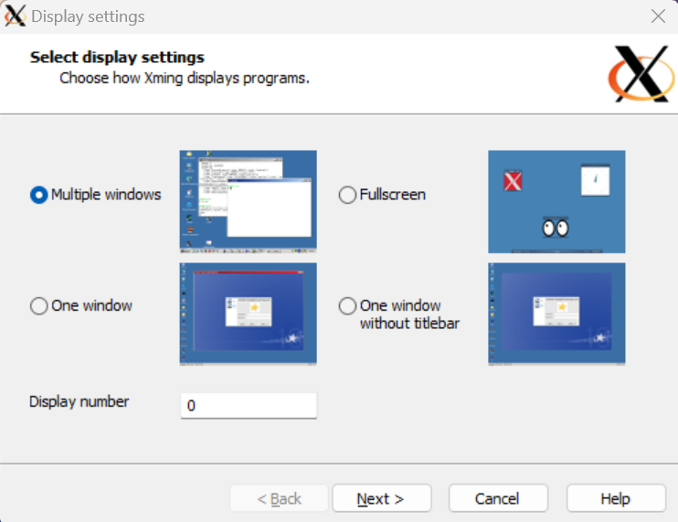
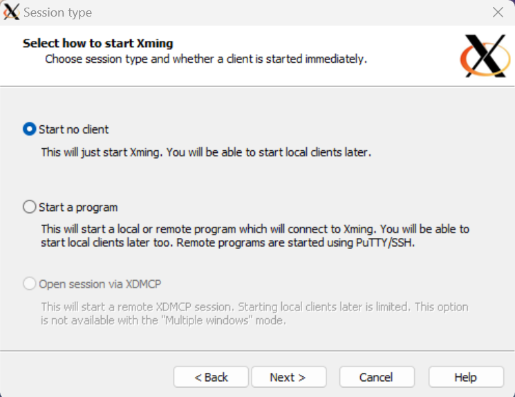
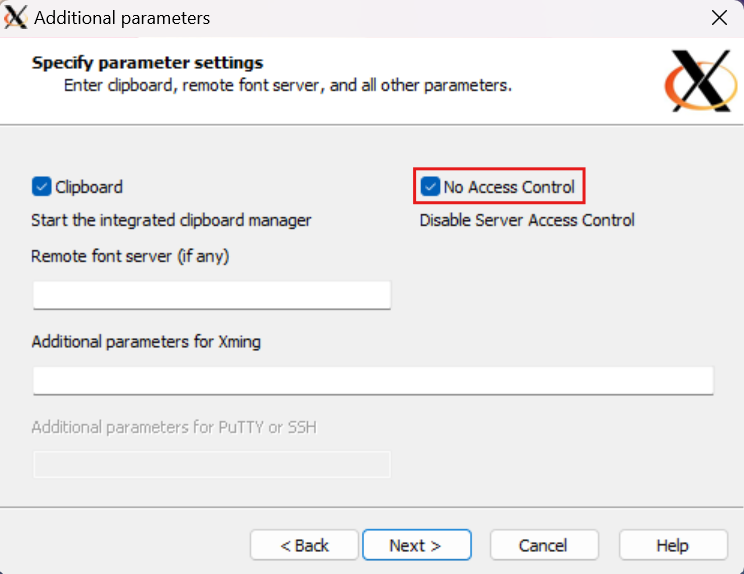
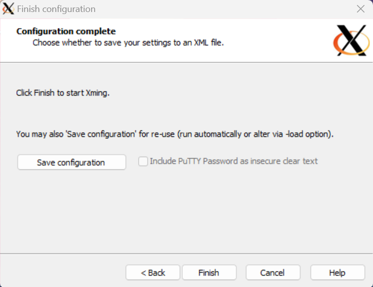

# Create a Docker image for a JavaFX application

Made by: [Ricardo de Sousa](https://github.com/IsNotRicardo)

> [!IMPORTANT]  
> This guide is exclusive for Windows devices.

## Introduction

This guide will show you how to create a Docker image for a JavaFX application. It will not, however,
show you how to create a JavaFX application. The following steps assume that you have a working JavaFX
application that you want to containerise.

## Prerequisites


## Dockerfile


## Xming Installation

In order to run a JavaFX application in a Docker container, you need to have an X server installed on
your machine. This will allow the JavaFX application to display its GUI on your device. In this guide,
we will use Xming as our X server, which you can install:

- [Through Chocolatey](#through-chocolatey), a package manager for Windows.
- [Through the Xming installer](#through-the-xming-installer).

### Through Chocolatey

1. Using the Windows search bar, search for `Windows Powershell` and run it as an administrator.

   

2. Check if you have Chocolatey installed by running the following command:

   ```powershell
   choco -v
   ```

   If you have Chocolatey installed, the version number will appear, and you can skip to the next step.

   Otherwise, you can install it by running the following command:

   ```powershell
   Set-ExecutionPolicy Bypass -Scope Process -Force; [System.Net.ServicePointManager]::SecurityProtocol = [System.Net.ServicePointManager]::SecurityProtocol -bor 3072; iex ((New-Object System.Net.WebClient).DownloadString('https://community.chocolatey.org/install.ps1'))
   ```
   
   This command might ask you for permission to run the Chocolatey installation script. Type `A` and press `Enter` to proceed.
   
> [!NOTE]
> This command comes from Chocolatey's [installation guide](https://chocolatey.org/install). Please refer to it for more information.
   
3. Install Xming by running the following command:

   ```powershell
   choco install xming
   ```
   
   This command will ask you for permission to run the Xming installation script. Type `Y` and press `Enter` to proceed.

> [!TIP]
> You can list all the packages installed by Chocolatey by running the following command:
> ```powershell
> choco list
> ```
> You should see `Xming` and its version number in the list of installed packages.

   You can now close the Windows Powershell terminal and proceed to the [next step](#xlaunch-configuration).


### Through the Xming installer

1. Download the Xming installer from [sourceforge](https://sourceforge.net/projects/xming/).

2. Run the installer and follow the installation instructions. You can leave the default settings as they are
   and click `Next` until you reach the final window.

   

3. Once you reach the final window, click the `Install` button to finish the installation.

    

   Once the installation is complete, proceed to the [next step](#xlaunch-configuration).

## XLaunch Configuration

After installing Xming, you need to configure XLaunch to run the X server. Start by searching for `XLaunch`
in the Windows search bar and running it. Alternatively, you can navigate to the following path:
`C:\Program Files (x86)\Xming` and run the `XLaunch` executable.

If you cannot find the `XLaunch` executable, make sure that you have [installed Xming](#xming-installation) correctly.

> [!IMPORTANT]
> You must run `XLaunch` and do the following configuration every time you start your computer to run the X server.

### Configuration Steps

1. Make sure that the `Multiple windows` option is selected and click `Next`.

   

2. Ensure that `Start no client` is selected and click `Next`.

    

3. Toggle the `No access control` option and click `Next`.

    

4. Click `Finish`. The window will close, and the X server will start.

    

