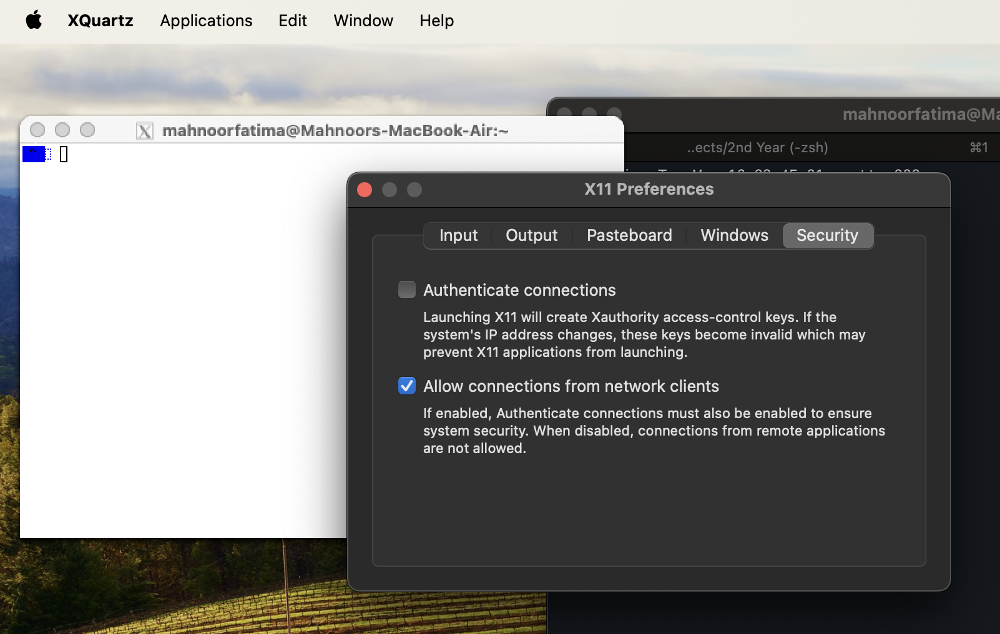

# Setting up an X server on macOS

In this guide, we will use XQuartz as our X Server, which you can install locally and that helps you run a GUI application through Docker:

## XQuartz Installation

Run the following command to install XQuartz:

```sh
brew install --cask xquartz
```

This command will ask you for permission to run the XQuartz installation script. Type `Y` and press `Enter` to proceed.

> [!NOTE]
> This command comes from XQuartz's [installation guide](https://www.xquartz.org/). Please refer to it for more information.

### XQuartz Configuration

**Set up XQuartz:**

```sh
open -a XQuartz
```


**Allow XQuartz to accept connections:**

Go to the Security tab and check "Allow connections from network clients".



**Set the DISPLAY environment variable:**

```sh
export DISPLAY=:0
```

**Allow connections to the X server:**

```sh
xhost +localhost
```

It should display the following message:

```sh
localhost being added to access control list
```


You have successfully configured XQuartz to run the X server. You can now proceed to the [next step](docker-javafx-guide.md#building-and-running).